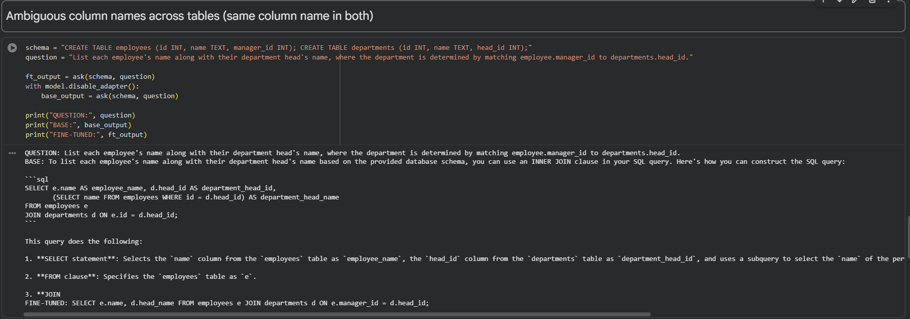
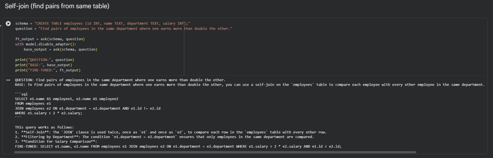

# Qwen2-7B QLoRA — Natural Language to SQL

Fine-tuning **Qwen2-7B-Instruct** with **QLoRA** (4-bit quantization + Low-Rank Adaptation) to generate SQL queries from a database schema and a natural-language question.

Follow-up to my earlier [Adaptive-Gpt2-LoRA](link) project, where I hand-implemented LoRA at the weight level on GPT-2 to understand the mechanics. This project applies that understanding to a model 60x larger (7.6B vs 124M params) — a scale where quantization isn't optional, it's the only reason fine-tuning is possible on a single free-tier GPU.

## Results

| Model | Execution Accuracy |
|---|---|
| Base (Qwen2-7B-Instruct, no adapter) | 3.12% |
| Fine-tuned (QLoRA adapter) | **57.29%** |
| Improvement | +54.17% |

Evaluated on 100 held-out samples from [gretel-synthetic-text-to-sql](https://huggingface.co/datasets/gretelai/synthetic_text_to_sql), execution accuracy (predicted SQL run against schema, output compared to gold).

## Why QLoRA, why this model

Qwen2-7B-Instruct in 4-bit takes ~4-5GB VRAM for frozen base weights — small enough to fit on a free Colab T4 (16GB), but too big to comfortably full-fine-tune or even LoRA-tune in fp16 on the same hardware. Unlike a 1-3B model (tunable without quantization), a 7B model on a T4 genuinely needs QLoRA to work.

Qwen2-7B-Instruct was chosen because it's already a strong general-purpose coding/reasoning model — making "before vs after" a fair test of whether fine-tuning improves *consistency on a narrow task*, not just "fixing a broken model."

## Example predictions

**Example 1 — ambiguous join column**



The question asks to match each employee's department via `manager_id` → `head_id`. The base model joins on `e.id = d.head_id` instead — comparing the employee's own ID to the department head ID, which is logically wrong and ignores `manager_id` entirely. The fine-tuned model correctly joins on `e.manager_id = d.head_id`, matching the intent of the question. This is a real reasoning error, not just a formatting difference — it's the kind of mistake that would silently return wrong results in production.

**Example 2 — self-join, duplicate pairs**



Both models correctly identify this as a self-join problem, but the base model filters with `e1.id != e2.id`, which returns every matching pair twice (A-B and B-A). The fine-tuned model uses `e1.id < e2.id`, which returns each pair exactly once — the correct behavior for a "find pairs" query. A subtle bug, but one that would double-count results if run for real.

*(base outputs also wrap correct SQL in long prose/markdown explanations, making them harder to parse programmatically — likely a contributing factor to the low base execution accuracy, separate from these logic errors)*

## Adapter

Trained LoRA adapter, hosted on Hugging Face: **[zain-the-npc/qwen2-7b-sql-qlora](https://huggingface.co/zain-the-npc/qwen2-7b-sql-qlora)** (verified upload, 31.6 MB — adapter weights + tokenizer, no base model included).

```python
from peft import PeftModel
from transformers import AutoModelForCausalLM

base = AutoModelForCausalLM.from_pretrained("Qwen/Qwen2-7B-Instruct", load_in_4bit=True)
model = PeftModel.from_pretrained(base, "zain-the-npc/qwen2-7b-sql-qlora")
```

## Repo structure

```
adapter/       # LoRA adapter weights
scripts/       # training + eval scripts
screenshots/   # base vs fine-tuned example outputs
requirements.txt
```
